# Aula 01 - O que é programação orientada a objetos

## Objetivo

Aproximar o mundo digital do mundo real

## Vantagens de programar orientado a objetos

C - Confiável  
O - Oportuno  
M - Manutenível  
E - Extensível  
R - Reutilizável  
N - Natural  
a  
d  
a   

### Confiável

O isolamento entre as partes gera software seguro. Ao alterar uma parte, nenhuma outra é afetada.
 
*Exemplo:* Em um controle remoto utiliza-se pilha, se alterar a pilha de uma marca A para uma pilha da marca B o controle irá funcionar da mesma maneira.  

### Oportuno

Ao dividir tudo em partes, várias delas podem ser desenvolvidas em paralelo.
 
*Exemplo:* Eu desenvolvo o objeto controle remoto e também desenvolvo o objeto pilha. Não preciso desenvolver primeiro o objeto controle remoto para só então desenvolver o objeto pilha, posso desenvolve-los simultaneamente.  

### Manutenível

Atualizar um software é mais fácil. Uma pequena modificação vai beneficiar todas as partes que usarem o objeto.
 
*Exemplo:* Se substituir a pilha comum que meu controle remoto utiliza por uma pilha recarregavel eu não preciso alterar nada e tenho a vantagem de não precisar mais comprar pilhas.  

### Extensível

O software não é estático. Ele deve crescer para permanecer útil.
 
*Exemplo:* O fabricante do controle remoto desenvolve um controle com 4 funcionalidades, e depois resolve lançar um controle mais atualizado com 6 funcionalidades, ele não precisa recriar o controle do zero, utiliza-se o primeiro controle como base e cria novas funcionalidades com o principio de extensibilidade.  

### Reutilizável

Podemos usar objetos de um sistema que criamos em outro sistema futuro.
 
*Exemplo:* Controle pode ser utilizado na camera A (go pro) e caso eu tenha outra camera que seja compativel com esse controle eu não preciso comprar um controle novo, eu reutilizo o controle que já possuo.  

### Natural

Mais fácil de entender. Você se preocupa mais na funcionalidade do que nos detalhes de implementação.
  

---

## Objeto

Coisa material ou abstrata que pode ser percebida pelos sentidos e descrita por meio das suas características, comportamentos e estado atual. 

_Exemplo:_ Objeto controle remoto 
Caracteristicas (atributos)  

- 1 tela
- 2 botões
- fabricante go pro
- módelo XYZ

Comportamentos (métodos)

- Ligar
- Gravar
- Pausar
- Desligar

Estado

- Está novo
- Está desligado
- Está sem bateria
- Está procurando uma rede

 
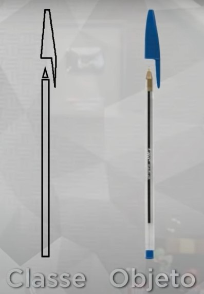

## Classe

Toda classe deve responder 3 perguntas: 

- ### Coisas que eu tenho (atributos)
- ### Coisas que eu faço (métodos)
- ### Como eu estou agora (estado)

### Classe Caneta

Coisas que eu tenho:

- Modelo
- Cor
- Ponta
- Carga
- Tampada

Coisas que eu faço:

- Escrever
- Rabiscar
- Pintar
- Tampar
- Destampar

Como eu estou agora?

- 50% de carga
- Ponta fina
- Azul
- Destampada
- Escrevendo

 
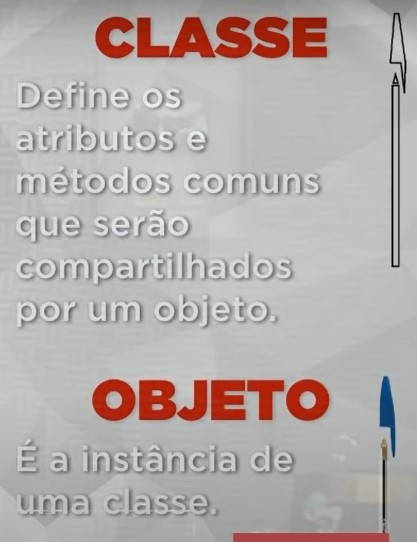

---

# Aula 03 - O que é visibilidade em um objeto?

Indica o nível de acesso aos componentes internos de uma classe (atributos e métodos).

## Modificadoresde visibilidade

### + Público

A classe atual e todas as outras classes terão acesso. 
_Exemplo:_ Orelhão: um telefone que qualquer um pode utilizar, posso utiliza-lo em qualquer lugar que o telefone esteja disponivel.

### - Privado

Somente a classe atual terá acesso. 
_Exemplo:_ Celular: somente eu posso utilizar

### # Protegido

A classe atual e todas as suas sub-classes terão acesso. 
_Exemplo:_ Telefone da casa: Só quem é da sua familia pode utilizar (minha mãe e seus filhos)

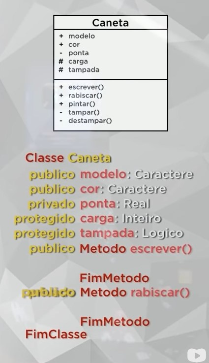

---

# Aula 05 - Exemplo prático com objetos

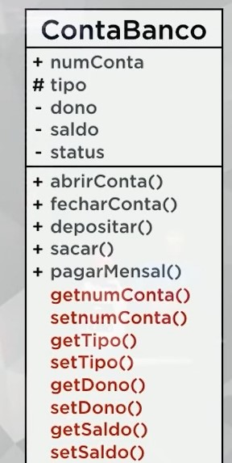

Orientações:

- Tipo da conta só: "CC" ou "CP"
- Abrir conta: muda o status para verdadeiro (por default status é falso)
- Construtor deve receber o tipo da conta, status falso, saldo 0
- Ao abrir conta: se CC ganha R$50, se CP ganha R$150
- Fechar conta: saldo deve ser igual a 0, nem maior e nem menor
- Depositar: status deve ser verdadeiro
- Sacar: status verdadeiro e saldo >= ao valor do saque
- PagarMensalidade: clinte CC paga 12, cliente CP paga 20

Jubileu

- Abrir Conta poupança
- Deposita 300

Creuza

- Abrir Conta corrente
- Deposita 500
- Saca 100

---

# Aula 06 - Encapsulamento

## Pilares da POO

- E: Encapsulamento
- H: Herança
- P: Polimorfismo

Encapsulamento: Lembre de capsula 
Herança: Lembre da herança que você vai receber da sua mãe 
Polimorfismo: Várias formas de se fazer a mesma coisa 

## Encapsular

Ocultar partes independentes da implementação, permitindo construir partes invisíveis ao mundo exterior. 
(pense em uma pilha, controle remoto ou um carro) 

Objetivos do encapsulamento

- Criar um padrão (ex: pilhas AA, eu posso utilizar de qualquer marca pois seguem o msm padrão);
- Proteção de mão dupla (do código com o programador e do programador com o código)

A troca de informações entre uma capsula e o mundo externo acontece através de mensagens

Quando se encapsula seus atributos devem ser privados ou protegidos, nunca públicos e os metodos farão manipulação dos mesmos.

## Interface

Lista de serviços fornecidos por um componente. É o contato com o mundo exterior, que define o que pode ser feito com um objeto dessa classe.

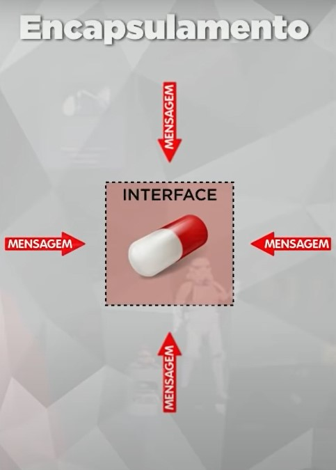

### Vantagens em encapsular

- Tornas mudanãs invisiveis (Ex: ao trocar uma pilha A por uma pilha B o controle remoto continua funcionando)
- Facilitar reutilização do código (Ex: posso utilizar a pilha do controle da tv e utilizar no meu video-game)
- Reduzir efeitos colaterais (Ex: posso danificar a pela ao tocar em uma pilha, ou meu suor pode enferrujar o contato e a pilha parar de funcionar)

---

# Aula 07 - Relacionamento entre classes

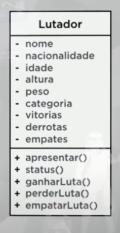

---

# Aula 09 - Exercicio de POO

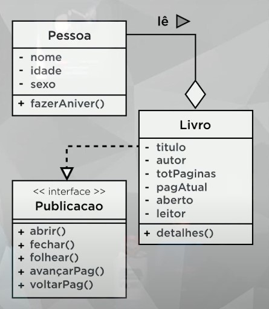

---

# Aula 10 - Herança (parte 1)

Permite basear uma nova classe na definição de uma outra classe previamente existente. 
A herança será aplicada tanto para as características (atributos) quanto para os comportamentos (métodos).

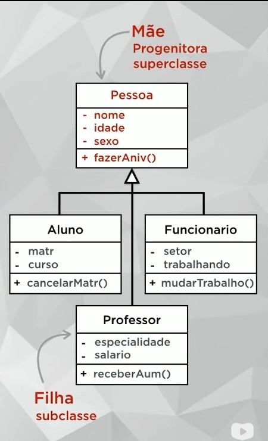

---

# Aula 11 - Herança (parte 2)

## Tipos de Herança

1. Herança de implementação (herança pobre) 
   Possui apenas os atributos e métodos herdados da mãe

2. Herança para diferença 
   Além dos métodos da classe mãe, implementa seus próprios atributos e métodos

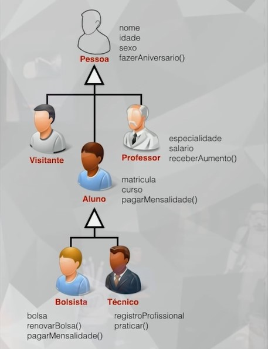

## Abstrato e final

### Abstrato

Não pode ser instanciada. Só pode servir como progenitora (outras classes devem extende-la).

### Final

Não permite que outras classes herdem dela, deve obrigatóriamente ser uma classe folha.

---

# Aula 12 - Polimorfismo de Sobreposição

Muitas formas de fazer algo 
Permite que um MESMO NOME represente VÁRIOS COMPORTAMENTOS diferentes.

## Assinatura do método

Quantidade e os tipos dos parâmetros

## Tipos de polimorfismo

Existem 4, mas será tratado apenas sobre 2. 

### 1) Sobreposição

Acontece quando SUBSTITUIMOS um método de uma superclasse na sua subclasse, usando a MESMA ASSINATURA.

### 2) Sobrecarga

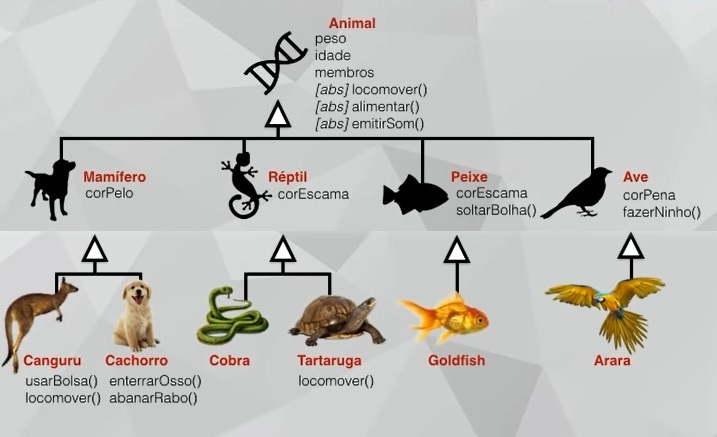

---

# Aula 13 - Polimorfismo de Sobrecarga

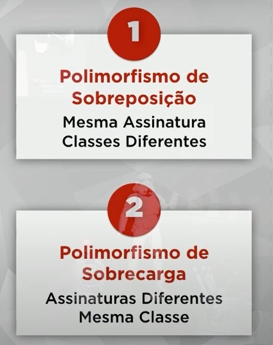

### Sobreposição

 Só acontece 1 vez em cada classe e deve ter a mesma assinatura em todas as classes 
 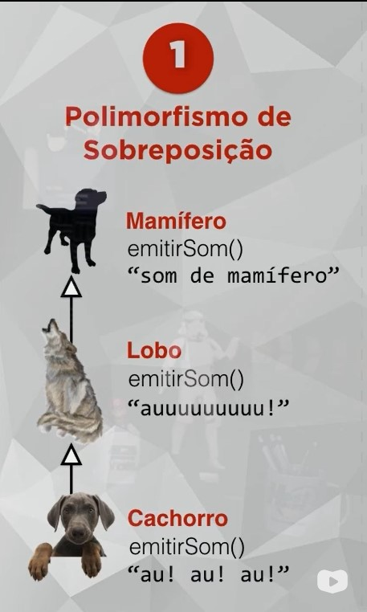

### Sobrecarga (PHP não suporta sobrecarga)

Acontece mais de uma vez em uma mesma classe, os métodos devem ter assinaturas diferentes 
Mesmo com assinatura diferentes o php diz que reagir já foi declarado
 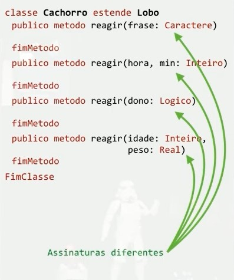

---

# Aula 14 - Exercicio de POO

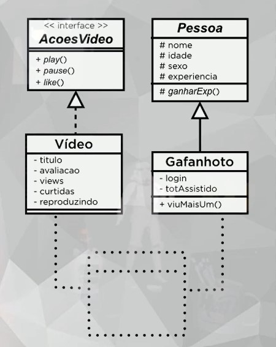

---

# Aula 14 - Exercicio de POO

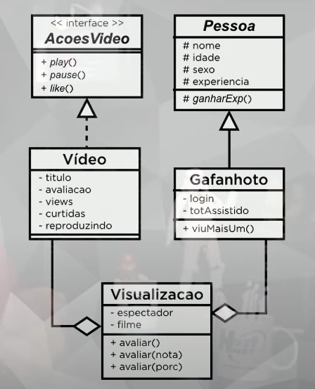
