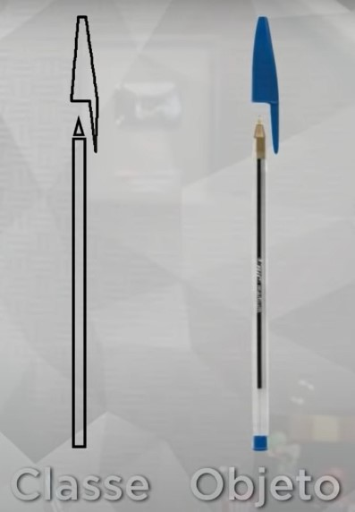
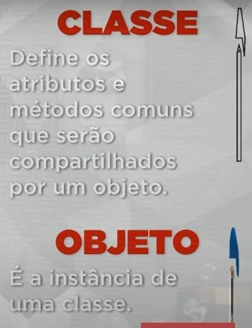

# 18/01/2023

# Aula 02A - O que é um objeto

## Objeto

Coisa material ou abstrata que pode ser percebida pelos sentidos e descrita por meio das suas características, comportamentos e estado atual. 

*Exemplo:* Objeto controle remoto 
Caracteristicas (atributos)  
* 1 tela 
* 2 botões
* fabricante go pro
* módelo XYZ

Comportamentos (métodos)
* Ligar
* Gravar
* Pausar
* Desligar

Estado
* Está novo
* Está desligado
* Está sem bateria
* Está procurando uma rede

 

## Classe
Toda classe deve responder 3 perguntas: 

* ### Coisas que eu tenho (atributos)
* ### Coisas que eu faço (métodos)
* ### Como eu estou agora (estado)

### Classe Caneta
Coisas que eu tenho:
* Modelo
* Cor
* Ponta
* Carga
* Tampada

Coisas que eu faço:
* Escrever
* Rabiscar
* Pintar
* Tampar
* Destampar

Como eu estou agora?
* 50% de carga
* Ponta fina
* Azul
* Destampada
* Escrevendo

 

## Atividade
Identifique dois objetos físicos do seu ambiente e dois objetos abstratos (ex: aula, compromisso) classifique-os. (atributos, métodos e estado)