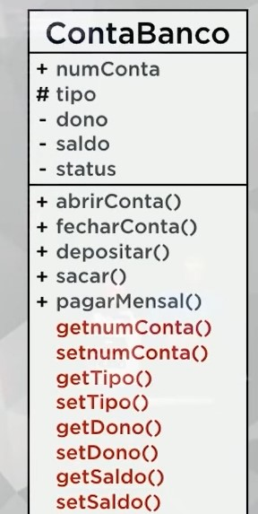

# Aula 05A - Exemplo prático com objetos

Orientações: 
- Tipo da conta só: "CC" ou "CP"
- Abrir conta: muda o status para verdadeiro (por default status é falso)
- Construtor deve receber o tipo da conta, status falso, saldo 0
- Ao abrir conta: se CC ganha R$50, se CP ganha R$150
- Fechar conta: saldo deve ser igual a 0, nem maior e nem menor
- Depositar: status deve ser verdadeiro
- Sacar: status verdadeiro e saldo >= ao valor do saque
- PagarMensalidade: clinte CC paga 12, cliente CP paga 20 

Jubileu
- Abrir Conta poupança
- Deposita 300

Creuza
- Abrir Conta corrente
- Deposita 500
- Saca 100