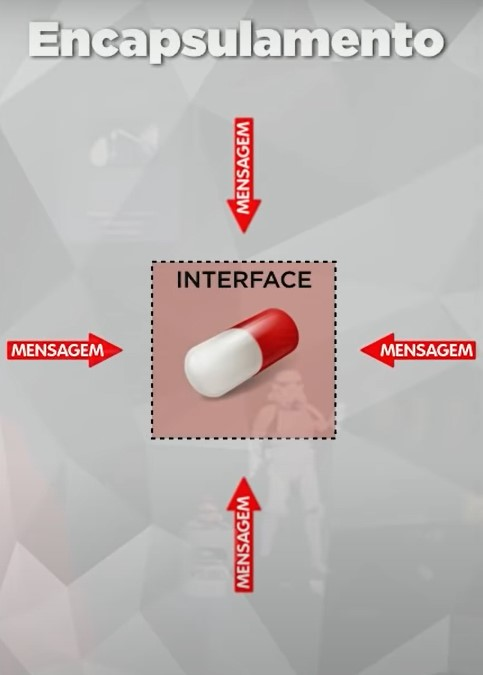

# 25/01/2023

# Aula 06A - Encapsulamento
<!-- Daqui em diante as aulas ficam dificeis -->

## Pilares da POO
- E: Encapsulamento
- H: Herança
- P: Polimorfismo

Encapsulamento: Lembre de capsula 
Herança: Lembre da herança que você vai receber da sua mãe 
Polimorfismo: Várias formas de se fazer a mesma coisa 

## Encapsular
Ocultar partes independentes da implementação, permitindo construir partes invisíveis ao mundo exterior. 
(pense em uma pilha, controle remoto ou um carro) 

Objetivos do encapsulamento
- Criar um padrão (ex: pilhas AA, eu posso utilizar de qualquer marca pois seguem o msm padrão);
- Proteção de mão dupla (do código com o programador e do programador com o código)

A troca de informações entre uma capsula e o mundo externo acontece através de mensagens

Quando se encapsula seus atributos devem ser privados ou protegidos, nunca públicos e os metodos farão manipulação dos mesmos.

## Interface
Lista de serviços fornecidos por um componente. É o contato com o mundo exterior, que define o que pode ser feito com um objeto dessa classe.

### Vantagens em encapsular
- Tornas mudanãs invisiveis (Ex: ao trocar uma pilha A por uma pilha B o controle remoto continua funcionando)
- Facilitar reutilização do código (Ex: posso utilizar a pilha do controle da tv e utilizar no meu video-game)
- Reduzir efeitos colaterais (Ex: posso danificar a pela ao tocar em uma pilha, ou meu suor pode enferrujar o contato e a pilha parar de funcionar)