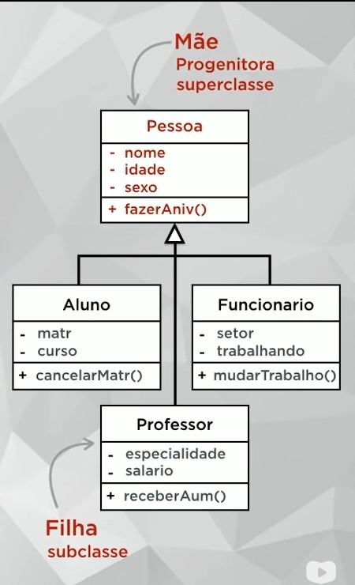

# 28/01/2023

# Aula 10A - Herança (parte 1)
Permite basear uma nova classe na definição de uma outra classe previamente existente. 
A herança será aplicada tanto para as características (atributos) quanto para os comportamentos (métodos).

