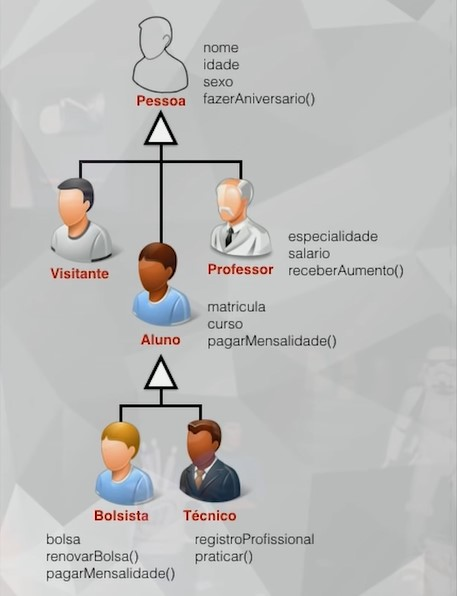
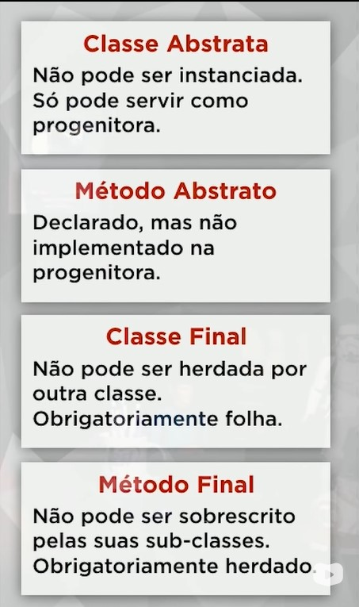

# 28/01/2023

# Aula 11A - Herança (parte 2)

## Tipos de Herança
1) Herança de implementação (herança pobre) 
Possui apenas os atributos e métodos herdados da mãe

2) Herança para diferença 
Além dos métodos da classe mãe, implementa seus próprios atributos e métodos

## Abstrato e final
### Abstrato
Não pode ser instanciada. Só pode servir como progenitora (outras classes devem extende-la).

### Final
Não permite que outras classes herdem dela, deve obrigatóriamente ser uma classe folha.

