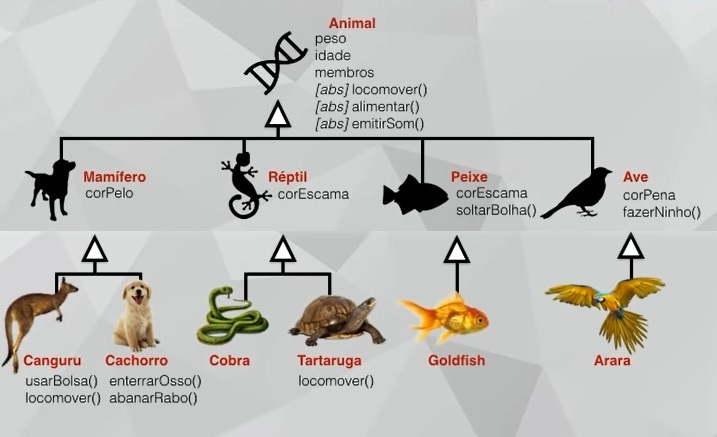

# 28/01/2023

# Aula 12A - Polimorfismo de Sobreposição
Muitas formas de fazer algo 
Permite que um MESMO NOME represente VÁRIOS COMPORTAMENTOS diferentes.

## Assinatura do método
Quantidade e os tipos dos parâmetros

## Tipos de polimorfismo
Existem 4, mas será tratado apenas sobre 2. 

### 1) Sobreposição
Acontece quando SUBSTITUIMOS um método de uma superclasse na sua subclasse, usando a MESMA ASSINATURA.
### 2) Sobrecarga

