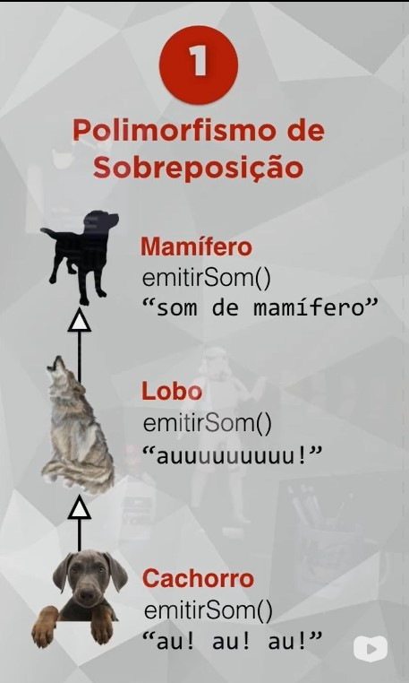

# 29/01/2023

# Aula 13A - Polimorfismo de Sobrecarga

### Sobreposição
Só acontece 1 vez em cada classe e deve ter a mesma assinatura em todas as classes

### Sobrecarga (PHP não suporta sobrecarga)
Acontece mais de uma vez em uma mesma classe, os métodos devem ter assinaturas diferentes 
Mesmo com assinatura diferentes o php diz que reagir já foi declarado
